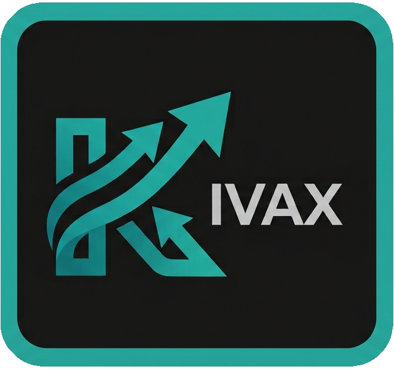

# Kivax

<p align="center">
  
</p>

<p align="center">
  <a href="https://github.com/null-result/kivax/actions/workflows/ci.yml"></a>
  <a href="LICENSE"></a>
</p>

Kivax is a runtime for spec-anchored Spec-Driven Development: the narrative spec compiles into a canonical yml, from which the plan, tests, and code are derived, with hash-verifiable traceability between them at every step.

Works with **Claude Code**, **opencode**, **Cursor**, **GitHub Copilot** (in VS Code and via Copilot CLI), and **OpenAI Codex CLI** — one project can use several at once.

**Contents** — [Quick start](#quick-start) · [Prerequisites](#prerequisites) · [Install](#install-once-per-machine) · [Set up a project](#set-up-a-project) · [Using it day to day](#using-it-day-to-day) · [Project files](#project-files-and-the-global-store) · [Keeping in sync](#keeping-in-sync) · [CLI](#cli-reference) · [Troubleshooting](#troubleshooting)

---

## Quick start

```bash
git clone https://github.com/null-result/kivax.git
cd kivax
python3 install.py
```

Then, at the root of the project you want to work on:

```bash
kivax init
```

Answer the wizard, then open your AI assistant in that project and ask it to start a new feature. That's it — the rest of this document explains each step in detail.

---

## Prerequisites

- **Python 3.10 or later**, with `pip` available (used to install PyYAML if it's missing).
- **git** — Kivax's traceability model diffs your branch against a base branch, so run `kivax init` inside a git repository, at its root.
- **At least one supported assistant**: [Claude Code](https://claude.com/product/claude-code), [opencode](https://opencode.ai), [Cursor](https://cursor.com), [GitHub Copilot](https://github.com/features/copilot) in VS Code, [GitHub Copilot CLI](https://docs.github.com/en/copilot/how-tos/copilot-cli), or [OpenAI Codex CLI](https://developers.openai.com/codex). You can mix several in the same project.
- Linux and macOS are the primary targets; Windows works via `cmd.exe`/PowerShell but is less battle-tested.

---

## Install (once per machine)

```bash
git clone https://github.com/null-result/kivax.git
cd kivax
python3 install.py
```

The installer copies the system into `~/.kivax` (the **global store**) and links the `kivax` command into a directory already on your PATH — it tries `~/.local/bin`, then `/usr/local/bin`. If it can't find one, it prints the exact `export PATH=...` line to add to your shell rc.

It is pure Python (no bash), so the same command works identically on Linux, macOS, and Windows, and it installs `pyyaml` automatically if it's missing. On Windows it also copies `kivax.bat`, needed because `cmd.exe` doesn't interpret the Python script's shebang line, and prints the folder to add to your PATH.

**Install somewhere else** — set `KIVAX_HOME` before installing, and export the same value in your shell so the CLI can find the store:

```bash
KIVAX_HOME=/opt/kivax python3 install.py
```

### Verify

```bash
kivax version
```

Should print the store path and the version. If you get `command not found`, see [Troubleshooting](#troubleshooting).

---

## Set up a project

Run this at the **root of your repository**, once per project:

```bash
kivax init
```

It's an interactive wizard that:

1. **Asks which assistant(s) you use** — Claude Code, opencode, Cursor, GitHub Copilot in VS Code, GitHub Copilot CLI, OpenAI Codex CLI. Any combination (Claude Code defaults to yes, the rest to no).
2. **Detects greenfield vs. existing code** (counts source files) and asks you to confirm — it never decides on its own. Stored as `greenfield` in the config, because the principles and architecture phases need it later.
3. **Asks whether to include the `principles` and `architecture` phases** (default yes) — see [Principles and architecture](#principles-and-architecture).
4. **Chooses the features root.** Kivax keeps one directory per feature under it (`specs/01-booking/`, `specs/02-cancel/`). If the project isn't greenfield it looks for `specs/`, `spec/`, `docs/specs/`… and offers what it finds — but if that folder already holds loose markdown, it says so and suggests a separate folder instead: Kivax never reads, moves, or migrates a pre-existing corpus of specs.
5. **Asks what language the spec *content* should be written in** (`spec_language`) — see [Language](#language).
6. **Detects your stack** by looking for `pom.xml`, `package.json`, `pyproject.toml`, `go.mod`… at the root and in first-level subdirectories (monorepo support), and presents it for confirmation.
7. **Detects git's base branch** for PRs and diffs.
8. **Proposes `legacy_globs`** if the project isn't greenfield — pre-existing files exempt from requiring a spec, for your confirmation. If it found a folder of spec documents you already had, that goes in too: those are documents, not untraced code, so editing one later isn't reported as a violation.
9. **Writes `.kivax/config.yml`**, creates the (empty) features root, and **copies** the agents, skills, and orchestrator instructions into the project as ordinary files. No spec is written yet: the first one arrives with your first feature.

### Commit what it creates

Everything `kivax init` writes is a normal file meant to live in git:

```bash
git add .kivax/ CLAUDE.md AGENTS.md .claude/ specs/   # plus .cursor/, .github/, .codex/, .opencode/ if you use them
git commit -m "chore: install kivax"
```

Teammates then need nothing but `git clone` — the agents, skills, and config are already in the repo. Running `kivax init` again on an already-installed project does nothing (no wizard, no re-copy); it tells you to use `kivax upgrade` instead.

### Check the setup

```bash
kivax doctor
```

Diagnoses the project's installation: missing config keys, an invalid `pipeline`, **a phase in `pipeline` with no matching `kivax-<phase>` skill** (the usual way a custom phase silently breaks), a gate that isn't `human`/`auto`, duplicate feature numbers or ids, a mistyped feature directory, tag regexes that predate the per-feature id form, empty agent/skill directories, a missing sync manifest, and leftover `.upstream` conflict files. It stays quiet about documentation folders you deliberately keep alongside your features — it only flags a directory that was clearly *meant* to be a feature.

---

## Using it day to day

Once installed, you drive Kivax by **talking to your assistant**, not by typing CLI commands. Each phase of the flow is a *skill* the assistant reads (`kivax-spec`, `kivax-plan`, …); you either name the skill or just describe what you want and let it trigger.

### The pipeline

The default sequence (the `pipeline` list in `.kivax/config.yml`):

```
principles → architecture → spec → compile → plan → tdd → it → audit → done
```

| Phase | Skill | What happens | Default gate |
|---|---|---|---|
| `principles` | `kivax-principles` | Ratifies `PRINCIPLES.md` once. Self-skipping if the file exists. | human |
| `architecture` | `kivax-architecture` | Creates `ARCHITECTURE.md` once. Self-skipping if the file exists. | human |
| `spec` | `kivax-spec` | Drafts/refines the narrative `spec.md` by interviewing you. | human |
| `compile` | `kivax-compile` | Compiles `spec.md` → canonical `spec.yml`; validates and hashes it. | human |
| `plan` | `kivax-plan` | Writes `plan.md` (contracts, REQ→module→test mapping), branches, opens a draft PR. | human |
| `tdd` | `kivax-tdd` | Per REQ: red unit tests, then minimum code until green. | auto |
| `it` | `kivax-it` | Integration tests from the spec's `integration_scenarios`. | auto |
| `audit` | `kivax-audit` | Traceability gate (`kivax trace`) + clean-context PR review. | human |

A **gate** is what happens at the end of a phase: `human` means the assistant stops and waits for your explicit approval; `auto` means it chains straight into the next phase. Gates are configurable per phase in `.kivax/config.yml`; an unconfigured gate is `human` (fail-safe).

**Exceptions are not gates and are not configurable.** An `AMBIGUITY`, `DISPUTE`, `GAP`, `CONFLICT`, `PRINCIPLES-VIOLATION`, a `NOT PASSING` audit verdict, or a failed validation **always** stops the flow and comes to you, even when the gate is `auto`. `auto` delegates approval, never quality control.

### A first feature, end to end

```
You:  Start a new feature: users can cancel a booking up to 24h before check-in.
```

The assistant runs `kivax-new`, which calls `kivax feature new cancel-booking`: that allocates the next feature number, creates `specs/01-cancel-booking/` with its own `spec.md`, and makes it the active feature. Then `kivax-spec`: it asks you clarifying questions, writes the spec, and stops at the `spec` human gate with its open questions and assumptions.

```
You:  Approved.
```

It compiles to `spec.yml` (`kivax-compile`), shows you the assigned REQ-IDs and the hash diff, and stops again. Approve, and `kivax-plan` explores your codebase, writes `plan.md` with concrete contracts, creates the branch, opens a draft PR, and stops.

```
You:  Looks good — run through to the audit.
```

That's `kivax-run`: it chains `tdd` (red tests → green code, one REQ at a time, one commit per REQ) and `it`, both `auto`, and stops at the `audit` human gate with the traceability verdict and the reviewer's findings. You merge; Kivax never does.

### Everyday commands (things you say)

| You want to… | Ask for | Notes |
|---|---|---|
| Start a feature | `kivax-new <description>` | Creates `specs/NN-slug/` with its own spec. One active feature per branch. |
| Write/refine the spec | `kivax-spec <request>` | The only phase that interviews you at length. |
| Run several phases at once | `kivax-run` | Stops at the first human gate or exception, and tells you which. |
| Know where things stand | `kivax-status` | Current phase, REQs by status, coverage, stale hashes. |
| Change a requirement after the fact | `kivax-evolve <change>` | Selectively invalidates only the affected REQs — never everything. Works on any feature, including ones that shipped long ago. |
| Build/query the knowledge wiki | `kivax-wiki ingest \| query <question> \| lint` | Derived from the specs; the spec always wins. |
| Document legacy code before touching it | `kivax-spec` ("document the current behavior of X") | Retroactive spec mode — describes what the code *does*, not what it should do. |

Five more skills are reference material the specialists read rather than phases you invoke: `kivax-spec-writing`, `kivax-yml-spec`, `kivax-tdd-loop`, `kivax-wiki-schema`, `kivax-tasks`.

**Vague ideas get researched first.** If you arrive with a problem that has no shape yet — or one whose answer depends on options nobody on the team has checked — the `spec` phase can bring in the **researcher** before the interview starts. It's the one agent that reaches the internet: it reads your principles, architecture, and code first so it only proposes things this project can actually do, then comes back with `specs/NN-slug/research.md` — two or more real options with their costs, concrete prior art, and every claim carrying a dated source URL. It writes no requirements; the spec-analyst uses the brief as the starting point of its interview, and you approve what makes it into the spec. It's optional and skipped by default when you already know what you want — the assistant asks rather than assuming.

> `kivax init` (terminal, project setup) is a different thing from `kivax-new` (chat, start a feature). The first is infrastructure and you run it yourself; the second is workflow.

### Artifacts you'll see

| File | Owner | Lifecycle |
|---|---|---|
| `specs/NN-slug/research.md` | researcher | Optional. Options, prior art, and cited sources behind a vague idea — input to the spec, never a requirement. |
| `specs/NN-slug/spec.md` | spec-analyst | That feature's narrative spec — the human-readable source. |
| `specs/NN-slug/spec.yml` | spec-compiler | That feature's canonical anchor. IDs are immutable; hashes drive invalidation. |
| `specs/NN-slug/plan.md` | tech-planner | Contracts, REQ→module→test mapping, implementation order for that feature. |
| `specs/wiki/` | wiki-curator | Optional compiled knowledge, one page per domain concept. |
| `.kivax/state.yml` | the CLI | Current phase and per-REQ status. The single source of truth across sessions. |
| `.kivax/traceability.lock.json` | trace-auditor | Hashes and REQ→tests from the last PASSING cycle. |
| `PRINCIPLES.md` / `ARCHITECTURE.md` | spec-analyst / tech-planner | Project-wide, opt-in. |

State lives in the repo, not in the assistant's context — you can close the session, come back tomorrow, and it picks up from `.kivax/state.yml`.

### Interrupted mid-agent

Knowing the phase isn't always enough. If the session dies while the tech-planner is halfway through exploring your modules, "phase: plan" tells the next session to start the plan — not to finish the one already half-written on disk. Re-running from scratch is worse than it sounds: an agent given the same prompt twice can produce a *different* plan, and you end up reconciling two.

So the long-running specialists — researcher, spec-analyst, tech-planner, test-writer, implementer, wiki-curator — write down their steps before working and mark them off as they go, via `kivax task`. The list lives in `.kivax/state.yml` beside the phase and the per-REQ status, and is archived and restored with its feature.

```bash
kivax task list
```

```
Phase 'spec' (01-cancel-booking):
  [x] 1. Read PRINCIPLES.md and ARCHITECTURE.md  <researcher>
  [~] 2. Search primary sources for option A  <researcher>  (3 of 6 sources checked)
  [ ] 3. Write research.md  <researcher>

1/3 closed.
Resume at: 2. Search primary sources for option A  <researcher>
```

You don't run this yourself in normal use: `kivax state show` ends with the same resume point, and the orchestrator reads it at the start of every session — it will tell you what was in flight and offer to continue rather than restart. The single-pass agents (spec-compiler, trace-auditor, reviewer) keep no list, because re-running them from scratch is already the right recovery.

These tasks are **not** requirements. A task is one agent's disposable working step; a REQ is the flow's contract, tracked separately and read by traceability. Nothing in the audit ever looks at a task.

### One spec per feature

Each feature gets its own directory, and it stays in the repo after the feature ships:

```
specs/
  01-booking/        spec.md  spec.yml  plan.md
  02-cancel-booking/ spec.md  spec.yml  plan.md
  wiki/              (project-wide, spans features)
```

The directory number prefixes every id in that spec — `REQ-01-001`, `IT-02-003` — so ids are unique project-wide and a test tag resolves to exactly one requirement. Numbering restarts per feature: feature 02 has its own `REQ-02-001`.

**Old specs keep being enforced.** `kivax validate`, `kivax hash`, and `kivax trace` all operate on the union of every feature's spec. Edit the spec of something that merged three months ago and its hashes change, its tests are flagged as potentially stale, and the audit blocks until that change goes through `kivax-evolve` — a spec change always has to produce a code change. Only the phase workflow is scoped to one feature: the *active* one, one per git branch.

You rarely touch this yourself; `kivax-new` and `kivax-evolve` drive it. The commands behind them are `kivax feature new <slug>`, `kivax feature list`, `kivax feature show --json`, and `kivax feature switch <NN>` (to resume a feature that already shipped).

---

## Language

Two deliberately independent things:

- **The CLI (`kivax`, `install.py`, the `lib/` scripts) is always in English.** Not configurable — it's infrastructure, not content, which keeps it maintainable and easy to get help with.
- **The specs' content follows `spec_language`**, a free-form value you set during `kivax init` (or edit later in `.kivax/config.yml`). The spec-analyst writes titles, descriptions, and acceptance criteria in that language regardless of what language you speak to it in — so you can converse in whatever you like and still guarantee specs land in, say, Spanish, if that's your team's documentation language.

The agents and skills (the instructions the assistant reads) are written in English and don't change with `spec_language`. That doesn't affect what language the assistant replies to you in, which always follows the conversation.

One technical constraint that never changes: the **keys** in `spec.yml` (`given`, `when`, `then`, `requirements`, `priority`…) are fixed. They're the format the scripts read literally; translating them would break validation and traceability. Only the prose gets translated.

---

## Principles and architecture

Two project-wide artifacts, distinct from the per-feature `spec.md`/`plan.md`, with opposite lifecycles:

- **`PRINCIPLES.md`** — the project's non-negotiable engineering principles, ratified once by the `principles` phase (the spec-analyst interviews you). It is **not** a living document: once ratified it changes only on an explicit request to amend it, never as a side effect of a feature.
- **`ARCHITECTURE.md`** — the system's actual technical shape, created once by the `architecture` phase (the tech-planner drafts it from the intended stack for a greenfield project, or reverse-engineers it from the existing codebase — decided by the `greenfield` flag) and then kept current **incrementally**: every `kivax-plan` updates only the sections the feature actually affects.

Both phases are **self-skipping**: if the file already exists the phase is a no-op and advances immediately, no gate involved — in practice they only do real work on a project's first feature. They're optional (decline them during `kivax init`, or remove them from `pipeline` later), but when present they're the only phases allowed to precede `spec`/`compile`.

Every `kivax-plan` and `kivax-audit` also cross-checks the feature against `PRINCIPLES.md` when it exists. A conflict is a `PRINCIPLES-VIOLATION:` — always escalated to you, never auto-resolved, regardless of the gate.

**Adopting this on a project installed before the feature existed** is a manual edit — `kivax upgrade` never rewrites `config.yml` for you:

```yaml
pipeline: [principles, architecture, spec, compile, plan, tdd, it, audit]
paths:
  principles: PRINCIPLES.md
  architecture: ARCHITECTURE.md
gates:
  principles: human
  architecture: human
```

---

## Extending the pipeline (custom phases)

The phase sequence is data: the `pipeline` list in `.kivax/config.yml`. You can **add, remove, or reorder** phases — including entirely custom ones — by editing that list. Two invariants are enforced and not configurable: **`spec, compile` must appear consecutively**, and **only `principles`/`architecture` may precede them**. Those two are what makes the flow spec-anchored; `kivax state` and `kivax doctor` reject any pipeline that puts a custom phase ahead of them.

To add a custom phase (say `deploy`):

1. Add `deploy` to `pipeline` and, optionally, a `deploy: human|auto` entry under `gates` (unset = `human`, fail-safe).
2. Add a `kivax-deploy` skill (a `SKILL.md` in a same-named folder) to every active runtime's skills directory — and, only for runtimes that support a separate specialist agent (claude, opencode, cursor, copilot-cli), an agent file too, if you want the step to run in an isolated context. These are ordinary project files: everything under `.claude/`, `.opencode/`, `.cursor/`, `.github/`, `.codex/` is yours to edit from the moment `kivax init` copies it in.

Kivax doesn't model what your phase does — environments, deploy targets, and test harnesses are your skill's business. It just runs it in order with its gate, and treats its failures as exceptions like any built-in phase. A complete working example (deploy + regression) ships with the store at `~/.kivax/examples/custom-phases/`: copy the files in, adapt the placeholder skills, done.

---

## Project files and the global store

`kivax init` copies agents, skills, and the orchestrator instructions into your project as real, ordinary, git-committed files. **Nothing in a project points back at `~/.kivax`** — every file is yours to open and edit, including changing an agent's `model:` line. This also means Kivax updates never change a project's behavior on their own: pulling in changes is always an explicit step (`kivax upgrade`), reviewable with `git diff` before you commit.

```
~/.kivax/                              (global store, one per machine — the "upstream")
  agents/<name>.md                     (canonical: description + tools + body — one file per
                                         specialist, PLUS orchestrator.md, shared by every runtime)
  runtime/skills/                      (shared by all 6 runtimes — 5 reference skills +
                                         13 phase-driver skills, e.g. kivax-spec/, kivax-plan/)
  lib/kivax_*.py                       (scripts, invoked via the CLI)
  lib/agent_runtimes.yml               (per-runtime agent frontmatter recipe)
  lib/kivax_agents.py                  (renders agents/*.md + agent_runtimes.yml into each
                                         runtime's agent-file shape)
  templates/                           (spec, plan, research, principles, architecture, state, PR…)
  examples/custom-phases/              (ready-to-copy pipeline extension)
  ci/                                  (sample CI gate workflow)

your-project/                          (all committed to git, no exceptions)
  .claude/agents/*.md        # your copy — edit any of these directly (includes orchestrator.md)
  .claude/skills/*/SKILL.md
  .opencode/agent/*.md       # if you use opencode
  .opencode/skills/*/SKILL.md
  .cursor/agents/*.md        # if you use Cursor
  .cursor/skills/*/SKILL.md
  .github/agents/*.agent.md  # if you use GitHub Copilot CLI
  .github/skills/*/SKILL.md  # if you use GitHub Copilot (VS Code and/or CLI)
  .github/copilot-instructions.md   # if you use GitHub Copilot in VS Code
  .codex/skills/*/SKILL.md   # if you use OpenAI Codex CLI
  CLAUDE.md / AGENTS.md      # same content, two filenames — Claude Code needs the former
  PRINCIPLES.md              # if you opted in — ratified once, rarely touched again
  ARCHITECTURE.md            # if you opted in — kept current via kivax-plan
  .kivax/
    config.yml               # project config, yours, editable
    state.yml                # flow state (phase, REQs)
    traceability.lock.json   # traceability lock
    sync.json                # tracks what each file was copied from, for 'kivax upgrade'
    templates/               # copy of the global templates
  specs/                     # your specs folder (or wherever you placed it)
    01-booking/              # one directory per feature, each with its own spec
      spec.md / spec.yml / plan.md
    02-cancel-booking/
      spec.md / spec.yml / plan.md
    wiki/                    # project-wide, spans features
```

SKILL.md content is identical across every runtime — only the destination directory changes.

**Agent files are the one thing not copied verbatim.** Each specialist — and the orchestrator itself — has a single canonical source (`~/.kivax/agents/<name>.md`: description, tools, body, no runtime-specific frontmatter), and `kivax init`/`kivax upgrade` render it into every active runtime's own agent-file shape on the fly, per the recipe in `~/.kivax/lib/agent_runtimes.yml`. Fixing an instruction once fixes it everywhere instead of needing the same edit repeated per tool.

The orchestrator's rendering is special in one way: besides landing as an ordinary agent file (`.claude/agents/orchestrator.md`, invokable explicitly on tools that support picking an agent), its frontmatter-stripped body is **also** what becomes `AGENTS.md` / `CLAUDE.md` / `.github/copilot-instructions.md` — the ambient context every runtime's default conversation reads. That's how the orchestrator is "the agent the human talks to" on tools without an agent picker.

To use a different model for one agent, edit its file in your project and change (or add) the `model:` line — a normal local edit that `kivax upgrade` will never overwrite. To make the pin the default for future projects, `kivax promote agent <name> --model-only`.

---

## Keeping in sync

### Pulling updates in: `kivax upgrade`

Run it inside a project. For every file Kivax manages it compares three things: the global store's current version, what the project last synced from (tracked in `.kivax/sync.json`), and the project's current version.

| Situation | What happens |
|---|---|
| You never touched it, upstream changed | Updated automatically |
| You touched it, upstream didn't | Left alone |
| Neither changed | Left alone |
| **Both changed** | Left alone; the new upstream version is saved beside it as `<file>.upstream` for you to merge by hand |
| A brand-new agent or skill was added upstream | Copied in |

`kivax doctor` flags leftover `.upstream` files until you resolve and delete them. `kivax upgrade --dry-run` previews without writing anything.

For agents, "the global store's current version" means: re-render the canonical source right now — so an upgrade always compares your file against the *current* canonical content, never a stale pre-generated copy.

This is the only thing that ever pulls from the global store into a project, and only when you run it.

### Pushing a change out: `kivax promote`

You tweaked something locally and want it to become the default for future projects:

```bash
kivax promote agent spec-analyst                # whole file
kivax promote agent trace-auditor --model-only  # just the model: line
kivax promote skill kivax-deploy                # phase-driver and reference skills work too
```

This writes into `~/.kivax`, so it affects new projects — and any existing project where you later run `kivax upgrade` there. Never automatically, never other projects on their own. Promoting a wholly custom agent that doesn't exist upstream creates it there, which is a convenient way to turn a one-off project agent into a new built-in.

Promoting an agent writes into the single canonical source, not a per-runtime file, so it propagates to every runtime with one command. The description and body always promote; the **tools list only promotes from `claude` or `copilot-cli`** — Cursor's `readonly` flag and opencode's deny-list can't be reversed back into an exact tools list, so promoting from those leaves the canonical tools alone and says so.

---

## CLI reference

You'll rarely type these — the assistant runs most of them for you. The ones you own are `init`, `upgrade`, `promote`, `doctor`, and `version`.

| Command | What it does |
|---|---|
| `kivax init [--force]` | Install/configure the current project (wizard), or report if already installed |
| `kivax upgrade [--dry-run]` | Pull non-conflicting updates from the global store into the project |
| `kivax promote <agent\|skill> <name> [--model-only] [--runtime <r>]` | Push a local file (or just its model) to the global store |
| `kivax doctor` | Diagnose the current project's installation |
| `kivax version` | Version and location of the global store |
| `kivax feature <new\|list\|show\|switch>` | Feature lifecycle: create one, list them, resolve its paths (`show --json`), or make an existing one active |
| `kivax validate` | Validate every feature's `spec.yml`. Exit 1 if invalid |
| `kivax hash [--diff] [--json] [--feature NN]` | Current hashes across all features, or the diff against the lock. **Exit 2 = there is pending work, not an error** |
| `kivax trace [--report-only\|--update-lock\|--json]` | Traceability audit across every feature: coverage, freshness, orphans. Exit 1 if NOT PASSING |
| `kivax state <show\|set-phase\|set-req\|sync-reqs\|gate\|next>` | Phase and per-requirement status of the active feature |
| `kivax task <add\|list\|set\|next\|clear>` | Per-agent checklists for the active feature. `list` shows where to resume after an interruption |
| `kivax wiki <lint\|stale> [--strict] [--json]` | Wiki provenance checks |
| `kivax specfirst [--json] [--base <branch>]` | Classify the branch diff into tests / kivax / legacy / production |

`--runtime` accepts `claude`, `opencode`, `cursor`, `vscode-copilot`, `copilot-cli`, or `codex`.

---

## CI

`~/.kivax/ci/github-actions-kivax.yml` (or `share/ci/` in this repo, if you haven't installed yet) is a sample CI gate: it validates the spec and runs `kivax trace`. It needs `kivax` installed on the runner — adjust the install step to however you distribute it (internal artifact, submodule, custom script). There's no single correct recipe there.

---

## Troubleshooting

**`kivax: command not found` after installing.**
The installer only links into a directory *already on your PATH*. Add the store's bin directory to your shell rc and open a new terminal:

```bash
export PATH="$HOME/.kivax/bin:$PATH"
```

**`ERROR: can't find the Kivax global store at ...`**
You installed with a custom `KIVAX_HOME` but didn't export it in the shell running `kivax`. Export the same value, or re-run `python3 install.py` with the default.

**`ERROR: PyYAML is missing`**

```bash
pip install pyyaml --break-system-packages
```

**`ERROR: .kivax/config.yml does not exist. Run 'kivax init' first.`**
You're not at the project root, or the project was never initialized. The scripts walk up parent directories looking for `.kivax/config.yml`, so this means it isn't anywhere above you.

**`kivax doctor` reports unresolved `.upstream` files.**
A previous `kivax upgrade` found a file changed both locally and upstream. Diff each `<file>.upstream` against `<file>`, merge by hand, then delete the `.upstream` sibling.

**`ERROR running git diff against 'main'` from `kivax specfirst` or the audit.**
The configured base branch doesn't exist locally. Fix `git.base_branch` in `.kivax/config.yml`, or fetch the branch.

**Every new requirement shows as uncovered even though the tests exist.**
The project's `id_tag_regexes` in `.kivax/config.yml` predate the per-feature id form, so tags like `REQ-02-001` don't match. `kivax doctor` detects exactly this and prints the replacement pattern; `kivax upgrade` warns about it too. Kivax never rewrites `config.yml` for you.

**`kivax trace` is NOT PASSING because of a feature I'm not even working on.**
That's the anchor doing its job: someone edited that feature's spec, so its hashes no longer match the lock and its tests may be stale. `kivax feature switch <NN>`, then run the `kivax-evolve` skill for it.

**`ERROR: refusing to write the lock`.**
`kivax trace --update-lock` rewrites the lock for every feature at once and refused because the rebuild didn't account for ids the lock already held — either a feature lost its `spec.yml` (recompile it) or a requirement was deleted outright instead of being marked `status: deprecated`.

**The audit says a file is a spec-first violation but it's pre-existing code.**
Add it to `legacy_globs` in `.kivax/config.yml` — and remove it again once you migrate that zone with a retroactive spec and tests.

**Windows: `kivax` isn't recognized.**
The installer prints the folder to add to your PATH. From PowerShell, add `%USERPROFILE%\.kivax\bin`, then open a new terminal.

---

## Updating or uninstalling

**Update the global store:** run `python3 install.py` again from a newer copy of the package (it overwrites `~/.kivax`). This does **not** touch any project by itself — run `kivax upgrade` inside each project you want to bring current.

**Uninstall from a project:** delete `.claude/`, `.opencode/`, `.cursor/`, `.codex/`, `CLAUDE.md`, `AGENTS.md`, and `.kivax/`. For `.github/`, don't delete the whole directory — it commonly holds unrelated CI workflows and issue templates — remove only Kivax's own paths: `.github/agents/`, `.github/skills/`, and `.github/copilot-instructions.md`. You lose the state and the lock if you hadn't committed them; since everything here is a normal file, `git log` has your history regardless.

**Uninstall from the system:** delete `~/.kivax` and the `kivax` entry it linked into your PATH (`~/.local/bin/kivax` or `/usr/local/bin/kivax`).

---

## Scope and limitations

Kivax's traceability model — spec hash ↔ tests ↔ code, verified against one git diff — **assumes a single git repository per installation**. It works well for a single repo and for monorepos (multiple stacks in one repo, via `stack.profiles[*].root`), but it does not span multiple independent repositories: a feature touching a separate frontend and backend repo needs a spec (and a `kivax init`) in each, with no built-in way to link their REQs together.

The flow drives **one active feature at a time per working tree** — `.kivax/state.yml` names a single active feature. That isn't a limit on how many features a project has (they accumulate, each with its own spec), but on how many you advance simultaneously in one checkout: git branches supply the isolation, one active feature per branch. Two branches cut from the same commit can both allocate the same feature number; `kivax validate` and `kivax doctor` treat a duplicated number as a hard error, and the fix is to renumber the branch that hasn't merged yet — its tests aren't on the base branch, so rewriting its ids and tags is still local and safe.

## Repository layout (this repo)

```
install.py            System-wide installer (copies share/ into ~/.kivax)
bin/kivax             The CLI
bin/kivax.bat         Windows wrapper for the CLI
assets/               Logo and other repo media
share/
  agents/             One canonical file per specialist (description + tools + body, no
                       runtime-specific frontmatter), PLUS orchestrator.md — the primary
                       coordinator, rendered like every other agent and additionally
                       stripped of frontmatter to produce AGENTS.md / CLAUDE.md /
                       copilot-instructions.md. Nothing here is copied verbatim.
  runtime/skills/     5 reference skills + 13 phase-driver skills, shared by all 6
                       runtimes (just placed in each one's own skills directory)
  lib/                kivax_*.py scripts the CLI dispatches to, the stack-profile catalog,
                       agent_runtimes.yml, and kivax_agents.py (the renderer)
  templates/          Starting scaffolds (spec, plan, research, principles, architecture, state, PR)
  examples/           Ready-to-copy extensions, e.g. custom-phases (deploy + regression)
  ci/                 Sample CI gate workflow
```

## Contributing

Issues and pull requests are welcome. [CONTRIBUTING.md](CONTRIBUTING.md) covers running the test suite, how the repository is laid out, and the conventions that aren't obvious from the code — chiefly that agents and skills are documentation the assistant *executes*, so they change alongside the CLI.

```bash
pytest tests                                                             # unit + integration + e2e
pytest tests --cov=. --cov-config=.coveragerc --cov-report=term-missing  # coverage gate (>= 90%)
ruff check . bin/kivax                                                   # lint
```

## License

[MIT](LICENSE).
